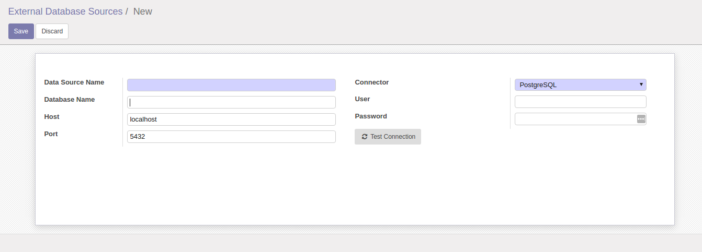
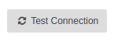
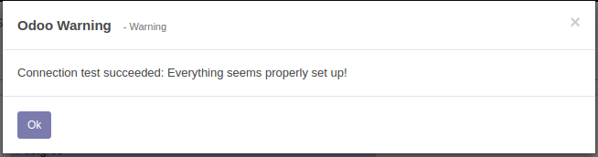
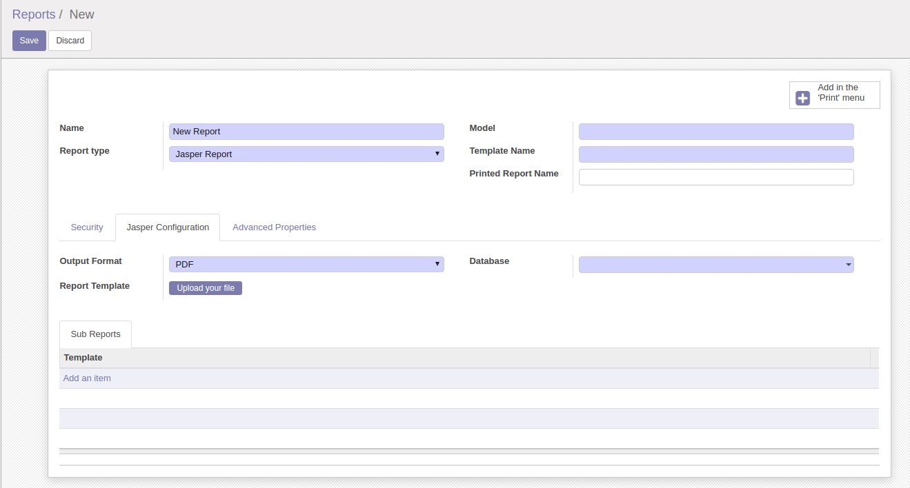

Jasper Report
=============

This module allows to print report using Jasper Report Builder.

Through the *pyreportjasper* Python api, you can print report using
Jasper Report tool. This modules are used like regular ODOO reports.

Configuration
=============

After installing the module you can go to *Settings > Dashboard* and active developer mode (you must be admin user).

After, go to *Settings > Technical > Jasper Reports > Configure Database Connection* to configure database configure.

When this module provide support to PostgreSQL only. Others database support will be added after. In the follow screen, add database data like host, port and other relevant fields.

*Data Source Name: a string name to identify record. You can add any value here.
*Database Name: your database name. Default is database of Odoo.
*Host: hots of database. Default value is *localhost*.
*Port: access port of your database. Default is 5432 (PostgreSQL port)
*Connector: plugin to connect in database. When, this only provide in PostgreSQL.
*User: User to connect in database.
*Password: Password of database user.

After insert the fields, press the button

A window will appeared with a message that connection is successfully. Otherwise, a error message will be show.

Create a Report Action
----------------------

The next step, is create a record on *Settings -> Technical-> Actions -> Reports*.

Create a new report and **Report Type** fields select **Jasper Report**. The page **Jasper Report** will be visible.

In this page, add the **.jrxml** template in **Report Template** field. Add to **.jrxml** of **subreports** if exist.
In **Database** field, select the database that you add before.

In **Model** field add the model where you report will be attached, i.e., **sale.order**, **account.invoice**, for example.
The **Template Name** is a name/id of report.

Finally, in right side, press the button

to add report in print menu on record screen.

Print the Report
----------------

Go in the page of model that you select in **Model** field and in the drop-down print button. You can print the report created.

Bug Tracker
===========

Bugs are tracked on `GitHub Issues <https://github.com/multidadosti-erp/multidadosti-addons/issues>`_.
In case of trouble, please check there if your issue has already been reported.
